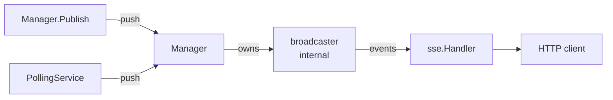
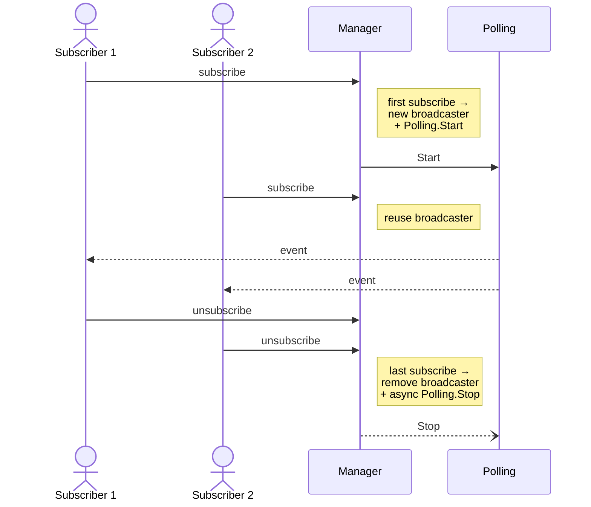

# sse — Server-Sent Events with topic-based fan-out

In-process pub/sub for HTTP SSE. One `Manager` per service holds the
topic registry; subscribers connect via `sse.Handler`; publishers push
via `Manager.Publish` or a `PollingService`.

## Overview



Data flows left to right. `Manager.Publish` and `PollingService` are the
two publisher entries; `sse.Handler` registers itself with `Manager` and
streams events out to the connected HTTP client. `broadcaster` is
package-internal — consumers never hold a reference.

## Two ways to produce events

| Source            | API                              | Use when                                                   |
| ----------------- | -------------------------------- | ---------------------------------------------------------- |
| Inside the pkg    | `WithPollingService(...)`        | Data is fetched on a timer (DB row, hardware state, ...).  |
| Outside the pkg   | `Manager.Publish(topic, data)`   | Data arrives from a message bus / callback / scheduled job. |

## Quick start

### Event-driven (external publisher)

```go
sseManager := sse.NewManager(serviceCtx, lc, 30*time.Second)

e.GET("/api/v1/alarms/sse", sse.Handler(
    sseManager,
    sse.WithCustomTopic("alarms"),
))

// Wherever an alarm fires:
sseManager.Publish("alarms", alarm)
```

### Polling-driven

```go
func devicesHandler(c echo.Context) error {
    polling := sse.NewPolling(lc,
        func(ctx context.Context) (any, error) { return fetchDevices(ctx) },
        sse.WithCustomPollingInterval(5*time.Second),
    )
    return sse.Handler(sseManager, sse.WithPollingService(polling))(c)
}

e.GET("/api/v1/devices/sse", devicesHandler)
```

### URL-derived topic (multiple views of the same endpoint)

```go
// Topic = request path + query, so different params get different broadcasters.
e.GET("/api/v1/device/sse", sse.Handler(sseManager))

// Publisher computes the same topic from the request context, or builds the
// string by hand.
sseManager.Publish(sse.ConstructSSETopic(c), event)
```

## Public API

| Symbol                          | Role                                                     |
| ------------------------------- | -------------------------------------------------------- |
| `NewManager`                    | Construct a Manager bound to a parent context.           |
| `Manager.Publish(topic, data)`  | Forward `data` to current subscribers of `topic`.        |
| `Manager.Shutdown()`            | Cancel context; active handlers drop their streams.      |
| `Handler(m, opts...)`           | Echo HandlerFunc that opens an SSE stream.               |
| `WithCustomTopic(topic)`        | Override the URL-derived topic.                          |
| `WithPollingService(s)`         | Attach a polling service to drive events for the topic.  |
| `ConstructSSETopic(c)`          | Build the default topic from a request URL.              |
| `NewPolling(lc, fn, opts...)`   | Construct a polling service.                             |
| `WithCustomPollingInterval(d)`  | Interval between polls (default 5 s).                    |
| `WithCustomApiVersion(v)`       | API version used in error payloads.                      |
| `WithStopCondition(fn)`         | Polling self-terminates when `fn(payload)` returns true. |
| `WithStopCallback(fn)`          | Invoked when polling stops, for any reason.              |
| `Publisher` interface           | `Publish(data any)`.                                     |
| `PollingService` interface      | `Start(Publisher)` / `Stop() error`.                     |

## Lifecycle



Map removal is synchronous so a concurrent `Publish` or `subscribe`
sees the fresh state immediately. The slow part (polling teardown)
runs in a goroutine to keep `unsubscribe` non-blocking.

## Design choices

| Decision                                              | Rationale                                                                                                              |
| ----------------------------------------------------- | ---------------------------------------------------------------------------------------------------------------------- |
| `Manager.Publish` returns no value                    | Fire-and-forget, like Redis pub/sub, NATS, in-memory event buses. SSE has no acknowledgement to return.                |
| `broadcaster` type is package-internal                | An exported broadcaster reference would escape Manager's lifecycle control — historical source of every race here.    |
| Topic strings are caller-defined (no validation)      | Use `ConstructSSETopic` for URL-derived topics, or shared constants between publisher and subscriber.                  |
| Polling lifecycle bound to first/last subscribe       | Polling does no work while nobody is connected. New `Polling` instance per `Handler` invocation (see quick start).     |
| Heartbeat sent on the configured interval             | Keeps idle connections alive through proxies; surfaces broken connections as a write error.                            |
